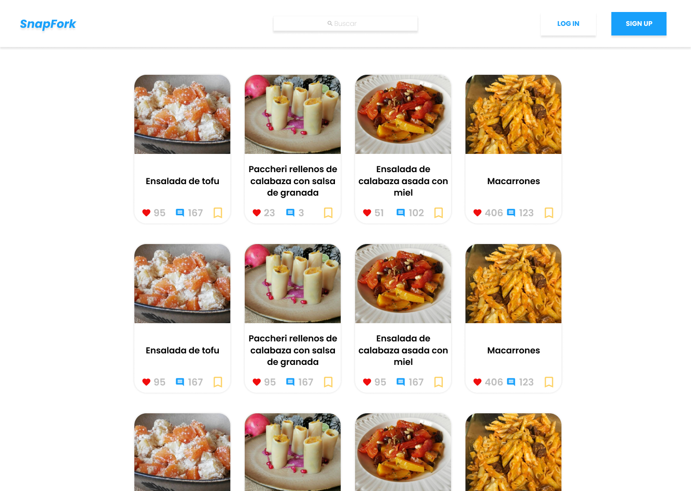

# Proyecto Instagram de Recetas: Frontend

## MVP Mockups

### Home

### Sign in

### Login

### Timeline Option 1

### Timeline Option 2

### Timeline Option 2 Extended

### Saved Recipes

### Profile

### Recipe

### New Recipe

---

## Authors

[Imar Abreu Díaz](https://github.com/izm20)  
[Francisco Javier Mendoza Álvarez](https://github.com/PanchoMen)  
[Miqueas García González](https://github.com/Sozhia)  
[Daniel Rodríguez Suárez](https://github.com/Danielmagox)
